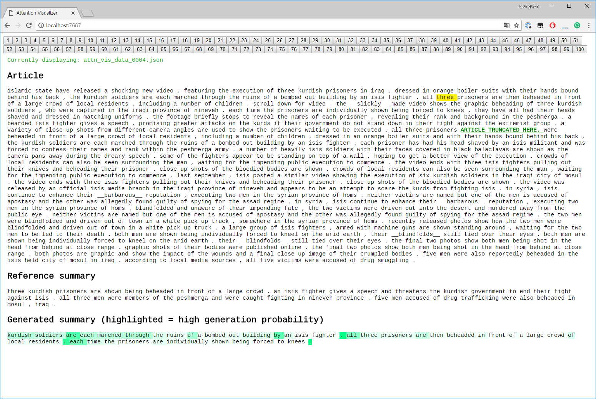

# Attention Visualizer



This is a tool to visualize the distribution of attention in a text-based sequence-to-sequence task such as summarization. As you hover your mouse over the decoded words, the tool shows a heatmap of attention over the source words. A demo can be seen [here](http://www.abigailsee.com/2017/04/16/taming-rnns-for-better-summarization.html) (scroll down to "Example Output" section).

Additionally, for pointer-generator networks such as that described in [this paper](https://arxiv.org/abs/1704.04368), the tool displays the _generation probability_ of each decoded word. This tool was designed to work with the [Tensorflow code](https://github.com/abisee/pointer-generator) for the paper.

## To run

To run the visualizer, run
```
python -m SimpleHTTPServer
```
from this directory then navigate to `http://localhost:8000/` in browser. The visualizer will show some example data.

## To use your own data

To visualize your own data, you need to replace `attn_vis_data.json` with a similar file, either produced by this [Tensorflow code](https://github.com/abisee/pointer-generator), or by your own model. In particular `attn_vis_data.json` should contain the following fields:

*  `article_lst`: the article (or source text) as a list of words
*  `decoded_lst`: the decoded (i.e. machine-generated) summary as a list of words
*  `abstract_str`: the reference summary as a single string
*  `attn_dists`: a list same length as `decoded_lst`, containing lists of length "attention length", containing probabilities.
    Note attention length must be <= length of `article_lst`.
    e.g. your article may have 500 words but you only fed the first 200 words into the model, thus attention length is 200.
    In this case the visualizer will mark the truncation point in the article.
*  `p_gens`: a list same length as `decoded_lst`, containing the generation probabilities.


WARNING: Make sure that none of the strings in `article_lst`, `decoded_lst`, or `abstract_str` contain `<angled brackets>`. These will interfere with the HTML and can result in text not being displayed.
